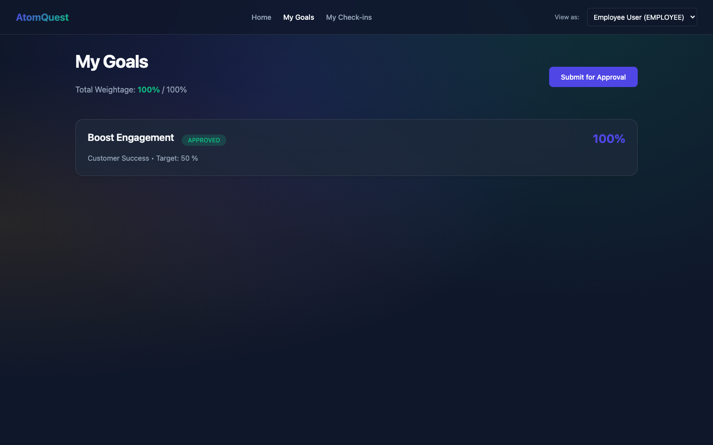
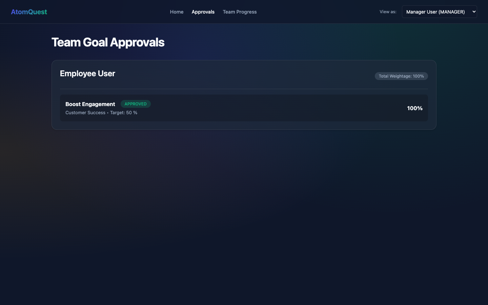
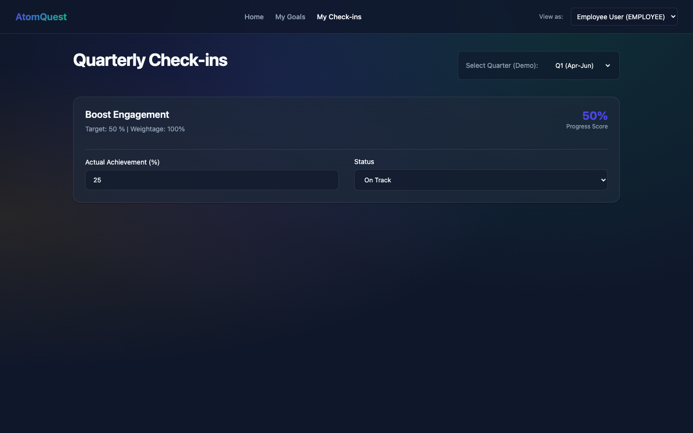
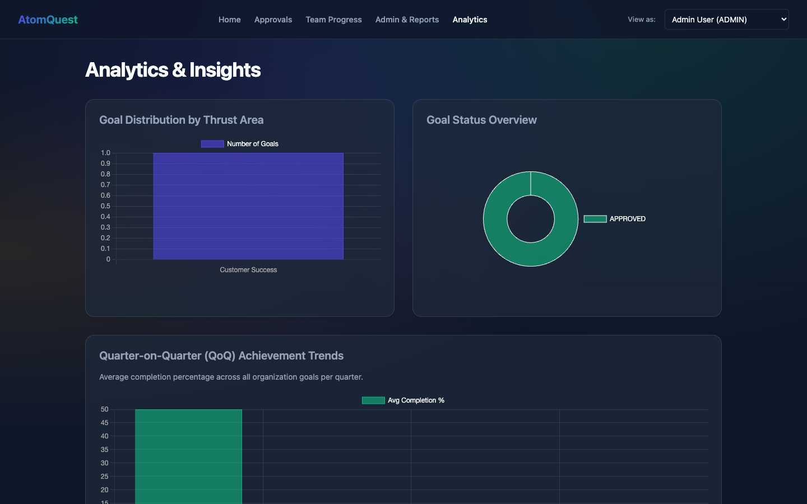
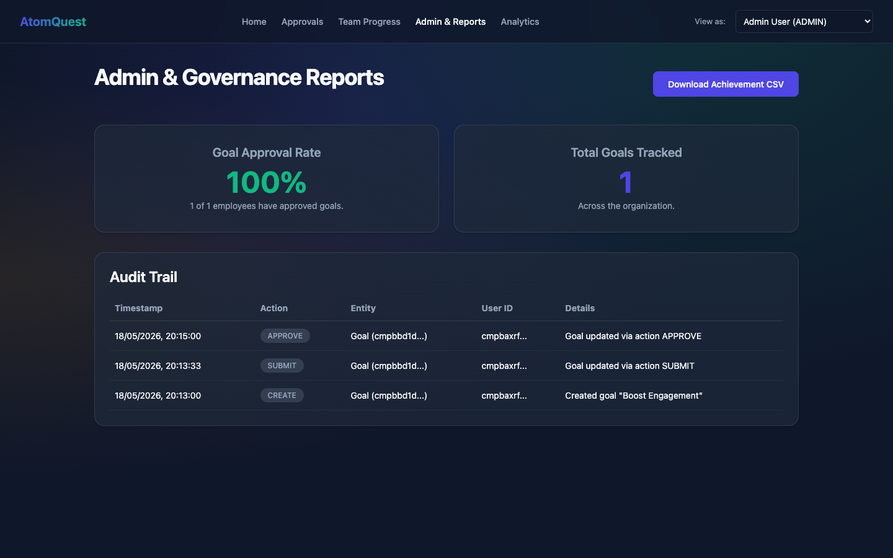

# AtomQuest Goal Setting & Tracking Portal

> Built for the **ATOMQUEST HACKATHON 1.0**

A structured, digital Goal Setting & Tracking Portal that eliminates manual spreadsheets. It supports the full lifecycle of employee goals — from creation and alignment to quarterly check-ins, performance visibility, and robust administrative reporting.

### 🌐 Live Production Demo
**[https://atomquest-goals-beta.vercel.app](https://atomquest-goals-beta.vercel.app)**

---

## 🎯 Core Features

### Phase 1: Goal Creation & Approval
- **Employee View**: Intuitive dashboard to create up to 8 goals. Strict validation ensures total weightage exactly equals 100% and minimum weightage per goal is 10%.
- **Manager View**: Consolidated view of all team members. Managers can adjust weightages inline and Approve or Return goals in a single click.

### Phase 2: Achievement Tracking
- **Quarterly Check-ins**: Employees log their `actualAchievement` and update status (On Track, Delayed, At Risk) for Q1, Q2, Q3, and Q4.
- **Team Progress Tracker**: Managers can view calculated percentage progress based on targets and provide structured comments/feedback.

### Phase 3 & Bonus: Governance & Analytics 
- **Admin Dashboard**: Real-time organizational completion stats (Approval Rates).
- **Audit Trail**: Every action (Creation, Approval, Check-in, Update) is logged securely with a timestamp and User ID.
- **Bonus Analytics (Feature 5.4)**: Beautiful `Chart.js` integrations showing Quarter-on-Quarter (QoQ) trends, Goal Distribution by Thrust Area, and Status Overviews.
- **CSV Export**: One-click download of all organizational goal achievements for offline analysis.

---

## 📸 User Journey Screenshots

### 1. Employee Dashboard (Goal Creation)


### 2. Manager Approvals


### 3. Employee Check-ins


### 4. Admin Analytics (Bonus Feature)


### 5. Admin Governance & Reports


---

## 🏗 System Architecture

The application is built on a modern, serverless stack designed for high availability and ease of deployment. 
- **Frontend/Backend**: Next.js (App Router) 
- **Database**: PostgreSQL (Hosted on Vercel/Prisma)
- **ORM**: Prisma Client
- **Styling**: Vanilla CSS Modules with a custom Glassmorphism design system (No Tailwind dependencies).

```mermaid
graph TD
    %% User Interfaces
    User([Employee / Manager / Admin])
    
    subgraph "Vercel Edge Network"
        NextJS[Next.js App Router]
        
        subgraph "Client Components (React)"
            Auth[Mock Auth / Persona Switcher]
            Dashboards[Role-Based Dashboards]
            Charts[Chart.js Analytics]
        end
        
        subgraph "Server Actions & APIs (Node.js)"
            API_Goals[/api/goals]
            API_CheckIns[/api/check-ins]
            API_Audit[/api/audit-logs]
        end
    end
    
    subgraph "Managed Database Cloud"
        PrismaORM(Prisma Client)
        Postgres[(PostgreSQL Database)]
    end

    %% Flow
    User -->|HTTP Requests| NextJS
    NextJS --> Auth
    NextJS --> Dashboards
    Dashboards --> Charts
    
    Dashboards -->|Fetch / Mutate| API_Goals
    Dashboards -->|Fetch / Mutate| API_CheckIns
    Dashboards -->|Fetch| API_Audit
    
    API_Goals --> PrismaORM
    API_CheckIns --> PrismaORM
    API_Audit --> PrismaORM
    
    PrismaORM -->|Connection Pool| Postgres
```

---

## 💻 Running Locally

If you wish to run the project locally instead of using the live link:

1. **Clone the repository:**
   ```bash
   git clone https://github.com/smarya-narang/atomquest.git
   cd atomquest-goals
   ```

2. **Install dependencies:**
   ```bash
   npm install
   ```

3. **Initialize the Local Database (SQLite for local dev):**
   ```bash
   npx prisma db push
   node prisma/seed.js
   ```

4. **Run the development server:**
   ```bash
   npm run dev
   ```
   *Open [http://localhost:3000](http://localhost:3000) in your browser.*

---
*Developed for AtomQuest Hackathon 1.0.*
